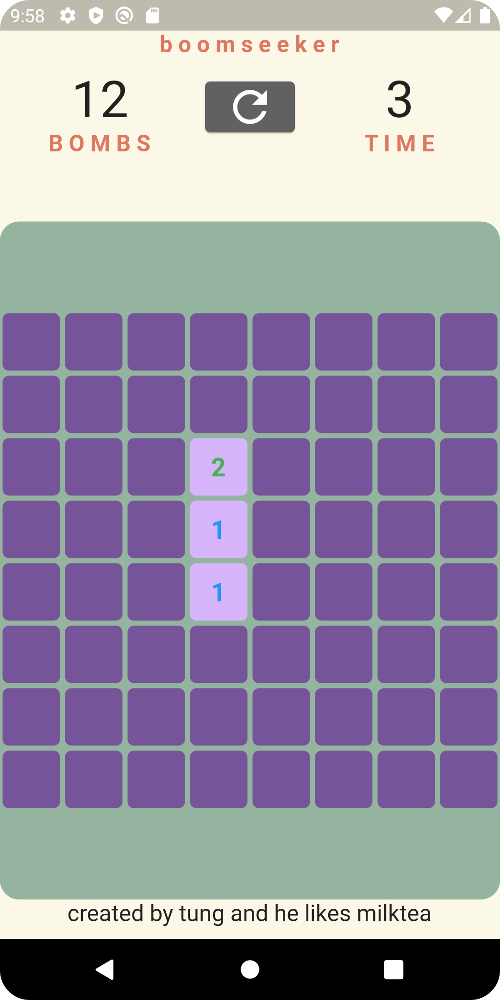
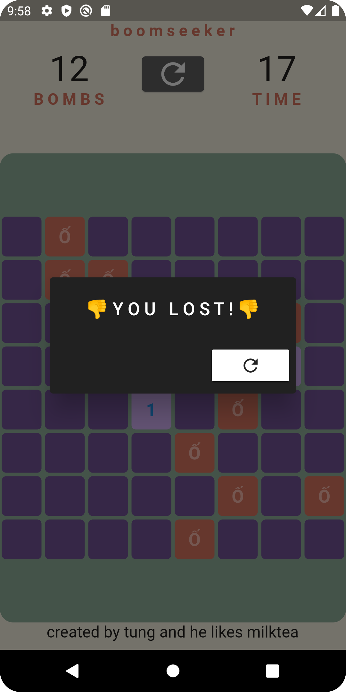
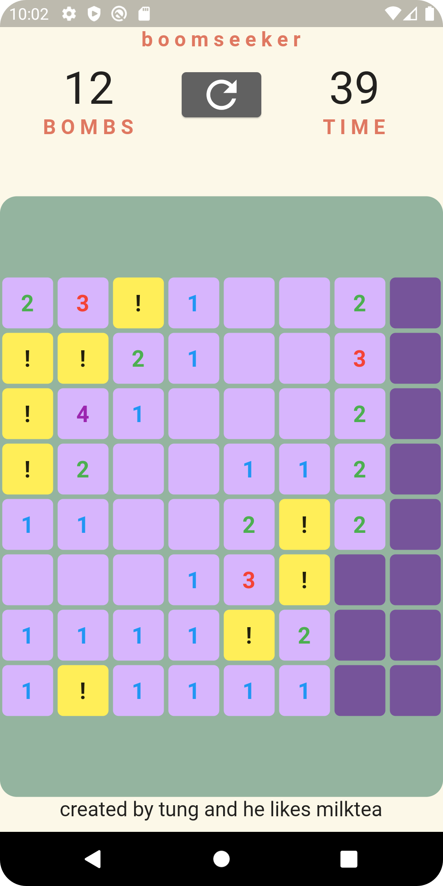
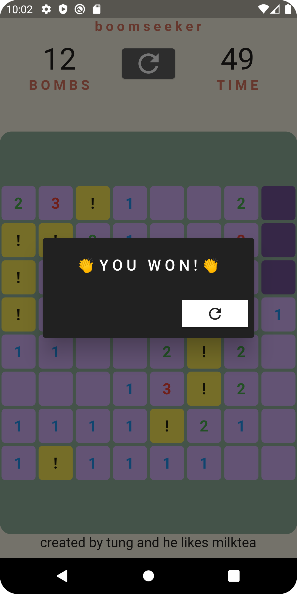

# boomseeker

A minesweeper clone

## Getting Started
- 8 x 8 grid, 12 bombs
- A square has 3 mode: unrevealed, reveal and marked
- Tap to reveal, long press to mark the square
- Time goes up when 2s pass

## Screenshots

    
    
    
    

